---
output:
  xaringan::moon_reader:
    yolo: false
    lib_dir: libs
    css: xaringan-themer.css
    seal: false
    nature:
      autoplay: 60000
      countdown: 60000
      highlightStyle: github
      highlightLines: true
      highlightSpans: true
      countIncrementalSlides: false
      #ratio: 16:9
      slideNumberFormat: "%current%"
editor_options: 
  chunk_output_type: console
---

```{r setup, include=FALSE}
options(htmltools.dir.version = FALSE)

knitr::opts_chunk$set(echo = TRUE, 
                      tidy = 'styler', 
                      comment = NA,
                      message = FALSE,
                      warning = FALSE)
```


```{r xaringan-themer, include=FALSE, warning=FALSE}
library(xaringanthemer)
style_duo_accent(
  primary_color = "#1381B0",
  secondary_color = "#FF961C",
  inverse_header_color = "#FFFFFF"
)

# Loaded packages and libraries
#------------------------------
  if (!require("pacman")) install.packages("pacman")
  pacman::p_load(knitr,styler,icons ,xaringanExtra,xaringan, tidyverse, kableExtra, countdown, janitor)


xaringanExtra::use_xaringan_extra(include = c("tile_view", "editable", "share_again", "broadcast", "animate_css", "panelset", "tachyons", "fit_screen", "clipboard", "search", "scribble", "freezeframe"))


use_webcam(width = 150, height = 150)

use_extra_styles()
```

background-image:url(images/parterners.png),url(images/AIMSlogo.jpg)
background-position: 0% 0%, 100% 0%, 0% 0%
background-size: 30%, 30%, 12% 

class: title-page, center, middle

## Statistical Learning Machine for Aeorsol Source Apportionmant.

### Case study of Kigali City, Rwanda.


`r format(Sys.time(), '%d %B, %Y')`

```{r, echo=FALSE}
use_logo(
  image_url = "images/AIMSlogo.jpg",
  link_url = "https://mgisa.netlify.app/",
  position = xaringanExtra::css_position(top = "1em", right = "1em"),
  exclude_class = c("title-page", "inverse", "hide_logo")
)
```

---
class: about-me-slide, inverse, middle, center

## About Facilitator


### Murera Gisa

#### Senior Data Scientist

.fade[National Bank of Rwanda (BNR), AIRA Analytics(Uganda) <br> Home-based Consultancy, Cenfri(Rwanda)<br> Big Data Expert]

[`r icons::fontawesome("link")` @myblog](https://mgisa.netlify.app/)
[`r icons::fontawesome("twitter")` @gisa_murera](https://twitter.com/gisa_murera)
[`r icons::icon_style(icons::fontawesome("github"), scale = 1)` @mgisa](https://github.com/mgisa)
[`r icons::icon_style(icons::fontawesome("phone"), scale = 1)` 0788266517](https://github.com/mgisa)
[`r icons::icon_style(icons::fontawesome("handshake"), scale = 1)` elgisamur@gmail.com](https://mgisa.netlify.app/)

???

class: about-me-slide, inverse, middle, center

---
class: middle

.w-100.lh-copy[

About:

> It aims to provide the relevant insights on the primary sources of aerosols. 

> It focuses on the paramount ability of Factor Analysis (PMF), the unsupervised learning technique to identify and quantify the main sources of aerosols in Kigali city.

> Draw the recommendations from the obtained results.

]
---
class: middle

.w-100.lh-copy[

Goal:

- Unleashing the potentiality of Supervised Learning Machine technique (PMF) to apportion the aerosol primary sources in region of interest.

> We intend to use the chemical speciated mass concentrations of urban non-refractory submicron particulate loadings in real time.

> They are collected by Aerosol Chemical Speciation Monitor, ACSM which has been successifully stationed at UR-CST, Kiyovu.

]
---
class: middle

.w-100.lh-copy[

Objectives:

> Understand the speciated chemical compositions of $\mathcal{PM}$ loadings measured by PIXE (Particle Induced X-ray Emission) built-in ACSM.

> Explore the possible sources of urban aerosols.

> Factor-based identification and quantification of prevailed main sources of urban aerosols.

]

---
class: middle

.w-100.lh-copy[

Key outcomes:

At the end of this workshop, participants will be able to:

> Have an overview of the main sources of urban aersols and their speciated chemical compositions.

> Understanding the ability of machine learning technique to identify and quantify the sources of urban aerosols.

> Have the policy measures in case of higher concentration of urban aerosols 

]

---
class: middle

.w-100.lh-copy[

Asking assistance

> PLZ!!! Ask questions, we've been down this road before!

> Please feel free to stop me and ask a question.

> If you feel more comfortable asking questions in writing feel free to email them to `elgisamur@gmail.com`

> Help each other out! Some might be further along their journeys than others.

]

---
class: middle

.w-100.lh-copy[

Summary:

- The atmospheric suspension system of fine solid and liquid particles in gas are called `Aerosols`, they come in many sizes and shapes and can be made up of hundreds of different chemicals. 

- Meteorologists usually refer them as particulate matter, depending on their size[(Fredrick G., 2028)](https://earthobservatory.nasa.gov/features/Aerosols).

- Their concentration is dynamic with time and space as results of many processes.

- Atmospheric aerosols play a significant role in both Earth’s climate and health.

- Depending on their composition, they may either absorb or reflect heat and sunlight, hence affect global weather and climate.

> ` Then it is highly required to apportion their sources, hence sustain the mitigation strategies`.

]

---
class: inverse, middle
name: toc

# Table of content

---
class:  middle

.w-100.lh-copy[

- Introduction:
         1. What is Aerosols?
         2. Source of Aerosols
         2. Aerosols and climate
         3. Aerosols and Health
          
- Statistical Apportionment: 
        1. Positive Matrix Factorization
        2. Application to Aerosol sources detection
            - Three steps processes.
            - Statistical treatment. 
            - Confirmation of the results
        3. Conclusions and way forward.
]

---
class: middle, center, inverse
name: beg0

# Introduction

---
class:  middle

.w-100.lh-copy[

> `What is Aerosol?`

- They are extremely too thin and small and you usually can't see them with naked eyes.

- However, in the areas that are highly polluted with aerosols, the difference is clear. 
    - You can see the difference here
    
```{r, out.width= "80%", out.height="70%",echo=FALSE, fig.align="center", fig.cap="Figure 1. The effect of particulate matter on visibility in Pittsburgh, PA"}
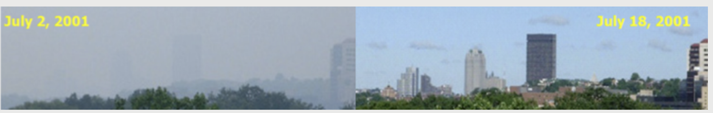
```

- __LEFT:__ there are very high levels of aerosols, which makes the sky look gray-ish and decreases the visibility. 

- __RIGHT:__ the levels of aerosols are much lower, which makes the sky look clearer.

]

---
class:  middle

.w-100.lh-copy[

- These very small liquid droplets and solid particles are lightweight,

- So they can float in the air for a long time without falling to the ground; in other words, they are __suspended__ in the air.

- When particulate matter is suspended in a gas, it is called an __aerosol__. 

-  However, the particulate matter in our atmosphere can also be referred to as an __aerosol__ because it is suspended within the gases in the air.
    - PM comes in a variety of sizes, but in general, the particles are too small. 
    - Fine particles (PM2.5) are particles that are less than $2.5$ $\mu m$ in diameter,
    - While coarse particles (PM10) are particles between $2.5$ and $10$ $\mu m$ in diameter.
] 
---
class:  middle

.w-100.lh-copy[

> `The sources`

- Aerosol particles come from a variety of sources; some are naturally occurring, while others are caused by human activities.

    - __Natural aerosols__: fog or mist, dust, forest exudates, and geyser steam

    - __Anthropogenic aerosls__: aerosols discharge at hydroelectric dams, irrigation mist, perfume from atomizers, smoke, dust, steam from a kettle, sprayed pesticides, smoke from fires, vehicle exhaust, and factories, biomass burning,etc

]
---
class:  middle

.w-100.lh-copy[

## Effects of Aerosols

> `Aerosols and climate`

- The climate of our planet is influenced by a number of factors including the aerosols.

- They have both `direct` and `indirect` effects.

- The _direct_ effects are based on the aerosol particles themselves, 

- And the _indirect_ effects are based on the ability of aerosol particles to help clouds form.

]
---
class:  middle
.panelset[
.panel[.panel-name[Direct Effects]

.pull-left[

```{r, out.width= "70%", out.height="90%",echo=FALSE, fig.align="center", fig.cap="Figure 2. The direct aerosol effect"}
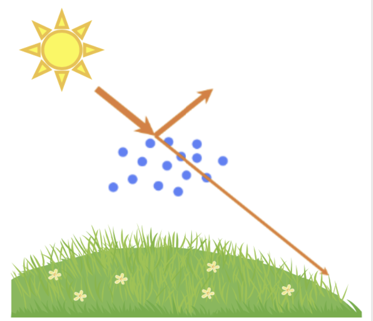
```
]
.pull-right[
- The __direct aerosol effect__ is based on the ability of the particulate matter to absorb sunlight or scatter it back into space (Figure2). 

- `Scattering:` they scatter $25\%$ the sunlight directly back into space resulted into `Global cooling and reduction of visibility` (haze or darkness) and redden (red) `sunrises and sunsets`.

- `Absroption:` They absorb the sunlight and resulting in a `global warming` effects.
]
]
.panel[.panel-name[Indirect Effects]

```{r, out.width= "80%", out.height="70%",echo=FALSE, fig.align="center", fig.cap="Figure 3. The direct aerosol effect"}
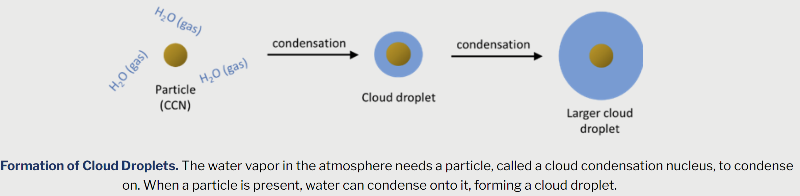
```

- __Indirect aerosol effects__ are related to how aerosols affect clouds.

- The aerosols need water droplets and condense, Therefore, they are less likely to fall out of the cloud as rain.
]
]
---
class: middle

.w-100.lh-copy[
## Effect of Aerosols

> `Aerosols and Health`

-  The health effects of the aerosols are directly related to their size. 

- They are easily penetrate into different parts of the human respiratory system.

- They affect the health of more people than any other pollutant worldwide, EPA and WHO noted.

- According to estimates from the WHO, particle pollution contributes to approximately $7$ million premature deaths each year, making it one of the leading cause of worldwide mortality.

- Scientific studies have linked particle pollution to a number of health problems such as: _`Aggravated asthma`_, _`Decreased lung function`_, _`Irritation of airways`_, _`coughing`_, and _`difficulty breathing`_, `Premature death in people with heart and lung disease`, `heart attacks, and Irregular heartbeat`.
   
]

---
class: middle

.w-100.lh-copy[

> Because of the negative impacts of aerosols, the government of Rwanda, under the REMA has set National Ambient Air Quality Standards to limit the levels of air pollutants, such as fine and coarse particles, in ambient air. The REMA uses a number between known as the Air Quality Index, or AQI, to report the daily air quality and its health concerns

 __To relevantly support this standards, the emerging technology like ML should step in to play several role in the game. Like aerosol source apportionment.__ 

]

---
class: middle, center, inverse

# Statistical Apportionment

---
class: middle

.w-100.lh-copy[

### Receptor Modeling and Blind Source Separation

- `Receptor modeling` is an approach bases on mass concentration which is used to `apportion sources` in the environment and to `identify source composition
to each sample and altered source patterns (Hopke, 1991).

- There exist two types of mass concentration approach models; `Chemical Mass Balance (CMB)`
which is primarily employed when the sources are known.

- And `Unsupervised Blind Source Modelling`, BSM (i.e PCA, NMF/PMF,Cluster analysis ) should be used when the signal sources are unknown.

- Since the urban aerosols sources prevailed in Kigali are quite unknown, we have utilized `BSM-based NMF algorithm`.

]

---
class: middle

.w-100.lh-copy[

## Blind Source Modeling

> `Description`

- `Blind Source Separation Modeling` is a method to estimate original signals from observed signals which consist of mixed original signals and noise (i.e Inverse problems).

```{r, out.width= "80%", out.height="60%",echo=FALSE, fig.align="center", fig.cap="Figure 4. Blind Source Separation workflow"}
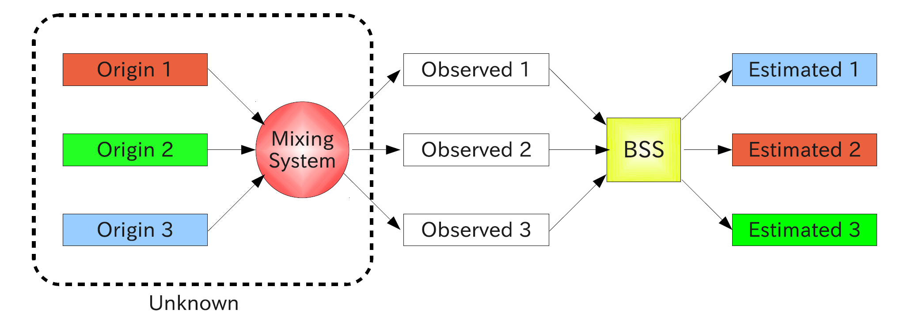
```

]
---
class: middle

.w-100.lh-copy[

### Example of Blind Source Separation

- BSS is often used for Speech and Image analysis.

```{r, out.width= "80%", out.height="60%",echo=FALSE, fig.align="center", fig.cap="Figure 5. Blind Source Separation workflow"}
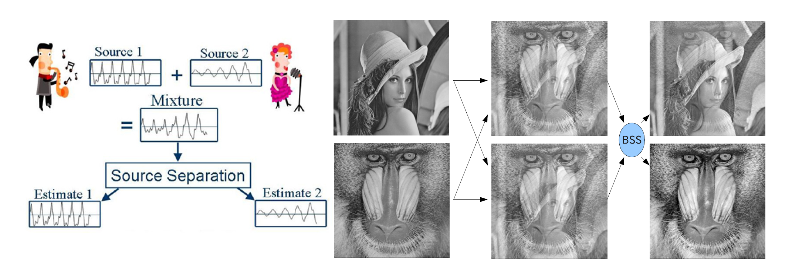
```

- In our case, the aerosols are sourced from mixture of different sources; then it adopted to split them into the individual source that are summed up to make the total urban aerosols.
]
---
class: middle

.w-100.lh-copy[

## Model Formulation

The problem of BSS is formalized as follow:
We consider a data matrix   
$\mathcal{D \in \mathbb{R}^{p \times n}}= \{(x_1,y_1),(x_2,y_2),\cdots, (x_n,y_n)\}$ where
$\mathcal{X_i}=(x_{i1},x_{i2},\cdots ,x_{ip})(1)$ 
denotes original signals, where $n$ is sample size of original signals, and $p$ is dimension
of signals.
We consider that the observed signals $\mathcal{Y \in \mathbb{R}^{p \times n}}$ are given by linear mixing system as:
$$
Y\approx AX+E (2)
$$

where $\mathcal{A \in \mathbb{R}^{p \times n}}$ is the unknown mixing matrix and $\mathcal{E \in \mathbb{R}^{p \times n}}$ denotes a noise for 
$n \gg p$

The goal of this method is to estimate $\hat{A}$ and $\hat{X}$ so that $\hat{X}$ provides unknown original
signal as possible.

```{r, out.width= "60%", out.height="35%",echo=FALSE, fig.align="center", fig.cap="Figure 5. BSS goal"}

```
]
---
class: middle

.w-100.lh-copy[

## Kind of BSS Methods

Honestly, degree of freedom of BSS model is very high to estimate matrix $\mathcal{A}$ and $\mathcal{X}$
Because there are a huge number of linear combinations which satisfy
$Y\approx AX+E$ due to the sample size$n$ and $p$ dimensions of considered data. 

Therefore, we need some constraint to solve the BSS problem such as:
- PCA: Orthogonal Constraint,
- SCA: Sparsity Constraint,
- NMF: Non-negativity Constraint,
- ICA: Independence Constraint,

From this way, there are a plenty methods to solve the BSS problem depending on the constraints.

> ` Knowing that the aerosol concentration in its sense are positive and their sources are not known, the NMF  appeared as nice algorithm to be used`.

]
---
class: middle

.w-100.lh-copy[
## Non-Negative Matrix Factorization

> `Description`

- Non-negative matrix is a matrix which its all elements are at least 0.
- Non-Negative matrix factorization (NMF) in its modern ML technique which has become a standard tool in the analysis of high-dimensional data sets.
- NMF was first introduced by Paatero and Tapper in 1994, and popularised in a article by Lee and Seung in 1999. Since then, the number of publications referencing the technique has grown rapidly. 

> `Meaning`

NMF approximates a matrix $\mathbf{Y}$ with a low-rank matrix approximation such that $\mathbf{Y} \approx \mathbf{A\times X +E}$.

- We consider that $\mathbf{X}$ is urban aerosol chemical compounds of $n$ data points each with $p$ dimensions, and every column of $\mathbf{X}$ is a speciated chemical compounds, such that  $\mathbf{X} \in \mathbb{R}^{p \times n}$.

]

---
class: middle

.w-100.lh-copy[
> ` Solving NMF Model`

By considering the standard NMF model which is 
$\mathbf{Y} \approx \mathbf{A\times X +E}$ where $\mathbf{A}\ge 0$ and $\mathbf{X}\ge 0$.

For simply, we denote $\mathbf{A}\ge 0$ as non-negativity of matrix $\mathbf{A}$.
The NMF problem is given by:

$$  
\mathrm{minimize} \frac{1}{2}||\mathbf{Y}-\mathbf{AX}||^2_F 
$$

subject to $\mathbf{A}\ge 0$ and $\mathbf{X}\ge 0$

> The `alternating least square(ALS) algorithm` is used to solve this problem and get the final answer of:

$$
\hat{\mathbf{X}}=\(\mathbf{A^T}\mathbf{A}\)^{-1}\mathbf{A^T}\mathbf{Y}
$$

Where $\mathbf{A}$ and $\mathbf{X}$ are $n\times r$ and $r\times p$ non-negative matrices respectively.
]
---
class: middle

.w-100.lh-copy[

> In practice, the factorization rank $r$ is often chosen such that $r \ll min(n,p)$.

The objective behind this choice is to `summarize` and `split` the information contained in $\mathbf{Y}$ into $r$ factors namely the columns of $\mathbf{A}$.

> As conclusion, each column of $\mathbf{Y}$ is approximated by a linear combination of the columns of $\mathbf{A}$ with the correlation coefficients corresponding to columns of $\mathbf{X}$. 
This extracts the underlying factors of the data as basis vectors in $\mathbf{A}$ which can then be used for `aerosol source identifications`
]

---
class: middle, center, inverse

#  Implementation on the data

---
.panelset[
.panel[.panel-name[Software]

## R and Rstudio

Implementation of NMF in R and Rstudio is simple and straightforward through the `library(NMF)` in-built engine.


```{r, out.width= "60%", out.height="50%",echo=FALSE, fig.align="center", fig.cap="Figure 6. nmf model infrastructure and pseudocode"}
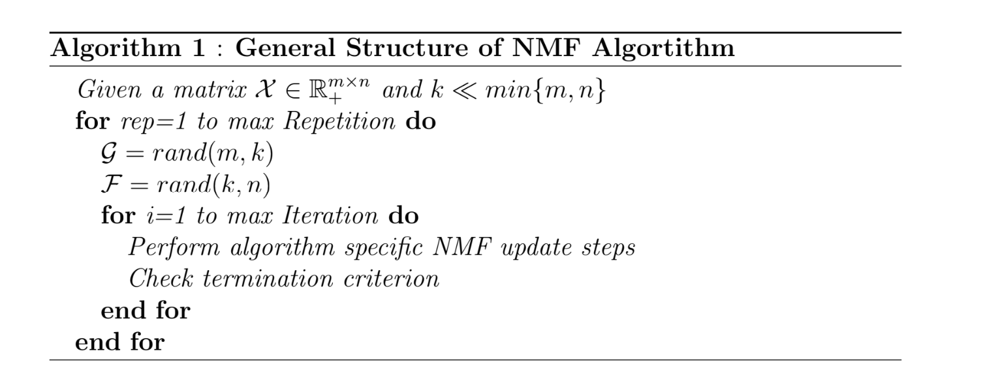
```
]
.panel[.panel-name[ACSM]

> Aerosol Chemical Speciation Monitor

```{r, out.width= "60%", out.height="40%",echo=FALSE, fig.align="center", fig.cap="Figure 6. The bench top of ACSM and chemical speciated process at $600^o C$(Source: _Watson,2017_)"}
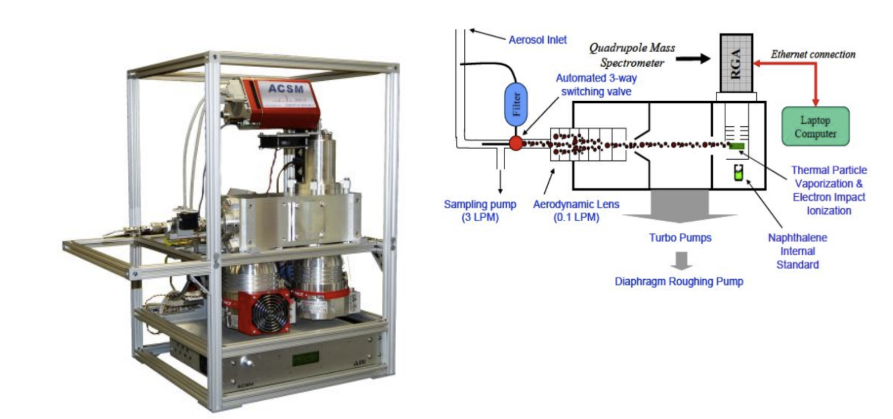
```

- The Aerosol Chemical Speciation Monitor is stationed at Rwanda Climate Observatory Lab, UR-CST station.

- The ACSM is chemically speciating the chemical compositions of loaded fine particulate matter through PIXE (Particle Induced X-ray Emission) method.
]

.panel[.panel-name[Data]

## Data and Sampling

> Data

- The obtained time series chemical compositions of aerosols are:
`Organics`, `Nitrate`, `Ammonium`,
`sulfate` and `Chloride`)

> Sampling

- The sample data used was collected from January 2020 to December 2022.
- The sample has been hourly averaged and reach to $26,280$ to accumulate the individual signals for 3 years and to reduce computation run time.

]
.panel[.panel-name[Modeling]

> Factor Identification

- The factor matrix $\mathbf{A_{ij}}$ of possible source contribution in aerosol compounds is follow:
    - `Factor 1`: Nitrate-rich secondary inorganic.
    - `Factor 2`: Sulphate-rich secondary inorganic aerosols.
    - `Factor 3`: Biomass burning
    - `Factor 4`: Traffic emissions
    - `Factor 5`: Metal industry/Chemical processing 
    - `Factor 6`: Crustal dust

- The data has been optimally preprocessed and _`nmf()`_ function used to compute `sum squares errors (cost function)` for each iteration and for every number of factors(factorization rank) $r$ (i.e $r \ll min(p,n)$)

- Therefore, $r=5$ has been selected since it presents the minimum SSE, silhouette and matrices sparseness.

]
.panel[.panel-name[Results]
.pull-left[
> Aerosol Chemical compound distribution

```{r, out.width= "80%", out.height="50%",echo=FALSE, fig.align="center", fig.cap="Figure 7. Species distribution"}
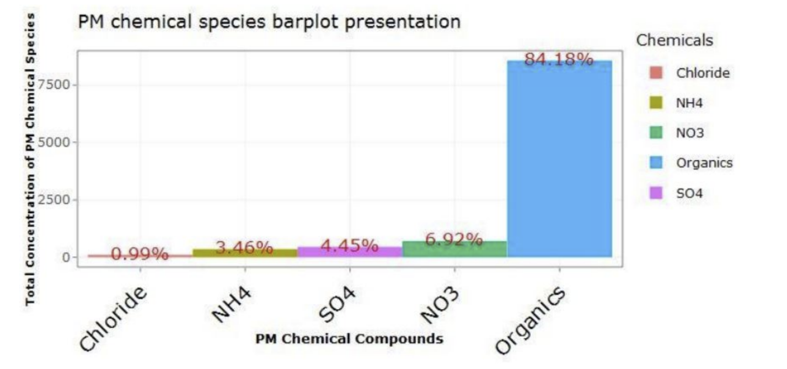
```

- Aerosol Chemical compound are predominated by organics 
]
.pull-right[

> Correlation matrix

```{r, out.width= "80%", out.height="50%",echo=FALSE, fig.align="center", fig.cap="Table 1. Species Correlation"}
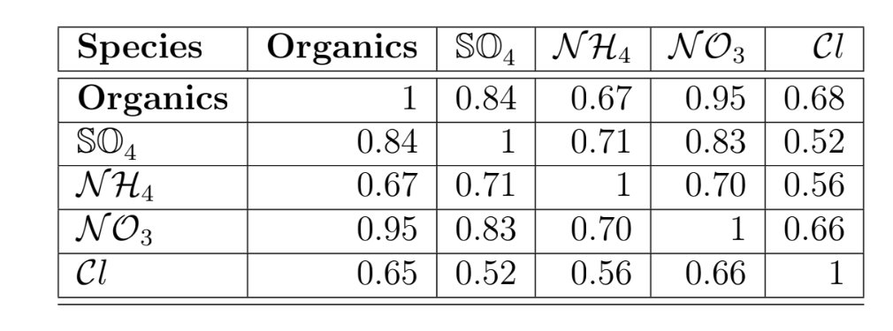
```

- The correlation coefficients are statistically significant. This allow us to combine `correlation analysis`  and `NMF` for source quantification (_Oja et al. 2004_).
]
]
.panel[.panel-name[Results]
.pull-left[

```{r, out.width= "100%", out.height="80%",echo=FALSE, fig.align="center", fig.cap="Table 2. Rotated Loading matrix(Profile Factors)"}
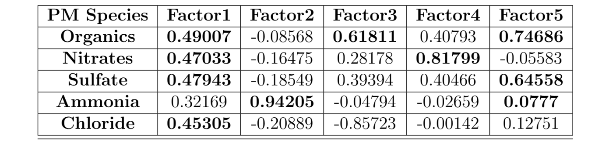
```

]
.pull-right[

```{r, out.width= "100%", out.height="80%",echo=FALSE, fig.align="center", fig.cap="Table 3. Aerosol species possible sources"}
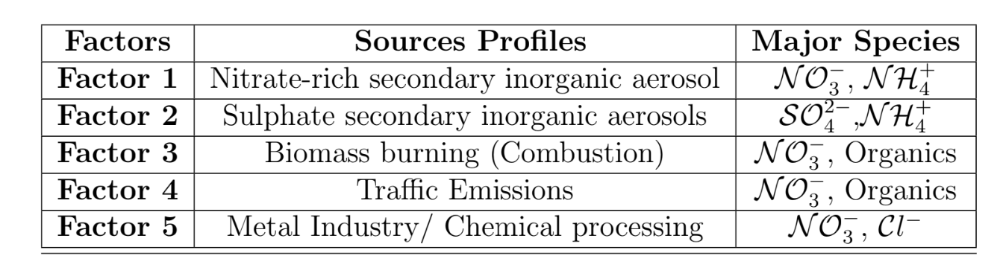
```

]
]
]
---
class: middle, center, inverse

# Aerosol Species Source Apportionment 
---
class: middle

.w-100.lh-copy[

### Source Identification

> Statistical hypothesis: `The highly correlated pollutants, are emitted from the same source.` 

> From the above hypothesis + Table 1, 2 and 3
we estimate and quantify the following sources:

- `Organics` are highly correlated to a `factor 5 and 3` at the rate of $74\%$
and $61\%$ respectively, 
Therefore, they are sourced from industrial `chemical processing (VOCs) and biomass burning`.

- Since the `Organics` is correlated with `nitrate` at $95\%$ and the later is sourced from `factor 4` which is `traffic emissions`,
Therefore, the `vehicles fuel burning` can emit largely both `organics (VOCs)` and
`nitrate`.
]
---
class: middle
.w-100.lh-copy[
### Source Identification

- The `sulfate` is highly related with `factor 5 and 1` at the rate $64\%$ and
$48\%$ respectively. And it is highly correlated with `organics` at rate of
$84\%$ and `ammonia` at $71\%$;
Therefore, they are sourced from `chemical processing` and from `Sulphate secondary inorganic aerosols`
(formed from the atmospheric oxidation of SO2 and is associated with long range transport.)

- `Chlorine` is correlated to `factor 1` at rate of $45\%$ and related with
`organics` at $68\%$ and `nitrate` at $66\%$,

Therefore, the chlorine possible sources are
`chemical processing`, `fuel burning`, `combustion`, and `Nitrate secondary inorganic aerosols` (combustion processes such as household and vehicle engines fuels).
]

---
class: middle, center, inverse

# Summary and Conclusion 
---
class: middle 

.w-100.lh-copy[

> `Summary`

- This methodology has been found
relevant in the task and it is not limited to air pollution only it might be used for other sources detection problems.
- The identification of the aerosols sources using this technique is complex in the area of AQ monitoring.
- However, it is essential to identify the pollutants sources and their contribution percentages on the pollutants inventory in order to support the Ambient AQ framework and mitigation strategies. 

> `Conclusion`

- This study shows that the main sources are `traffic emissions, Biomass Burning, VOCs` sourced from households and industrial processing(SULFO:cosmestics,detergent process) and commercial activities(MATHEUS).

- The future study might focused on the predictive and forecasting learning of aerosol pollutants levels over 24 to 48 hours.

- This enhance the effective adjustment of behavior to reduce public exposure and serious health risks of aerosols.
]
---
class: middle
### Biography

- Cichocki, A., Zdunek, R., Phan, A. H., and Amari, S.
(2009). Nonnegative Matrix and Tensor Factorizations: Applications to Exploratory Multi-way Data Analysis.

- Cichocki, A., Cruces, S., and Amari, S.-i. (2011). Generalized alpha-beta divergences and their application to robust nonnegative matrix factorization.

- Honkela, T., Duch, W., Girolami, M., and Kaski, S.,
editors (2011). Kullback-Leibler Divergence for Nonnegative Matrix Factorization, volume
6791 of Lecture Notes in Computer Science. Springer Berlin / Heidelberg.

---
class: middle, center, inverse

#  THANKS

